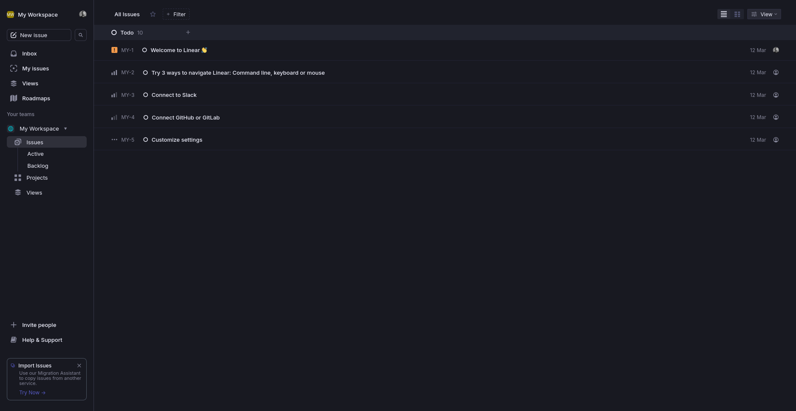

# My workspace

This is a [Next.js](https://nextjs.org/) project, bootstrapped with [`create-next-app`](https://github.com/vercel/next.js/tree/canary/packages/create-next-app).

## Table of Contents

- [Getting Started](#getting-started)
- [Installation](#installation)
- [Running the Development Server](#running-the-development-server)
- [Project Structure](#project-structure)
- [Technologies Used](#technologies-used)
- [Screenshot](#screenshots)

## Getting Started

To get a local copy of the project up and running, follow these simple steps.

### Installation

1. **Clone the repository**:
   ```bash
   git clone https://github.com/tasnim2512/My_workpsace.git
2. **Navigate to the project directory**:
cd My_workspace

3. **Install dependencies**:
First, run the development server:

```bash
npm install
# or
yarn install
# or
pnpm install
# or
bun install
```

### Running the Development Server

First, run the development server:

```bash
npm run dev
# or
yarn dev
# or
pnpm dev
# or
bun dev
```

### Project Structure
First, run the development server:

```bash
My_workspace/
├── app/
│   ├── page.js           # Main page component
│   └── layout.js         # Main layout component
├── components/           # Reusable components
├── public/               # Static assets
├── globals.css           # CSS and styles
├── package.json
└── README.md

```
### Technologies Used
- Next.js: For server-side rendering and file-based routing.
- React: Front-end library for building user interfaces.
- Tailwind CSS (optional): For utility-first CSS styling.

### Screenshot




